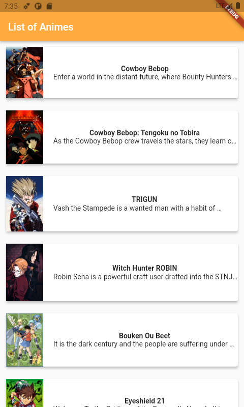
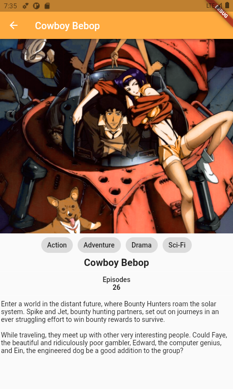
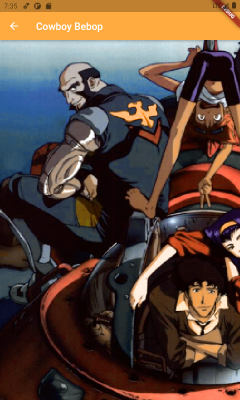

# AnimaGraphql

This project purpose is get animes from graphql and list on the screen. User can look detail these animes and user can look anime cover image in detail.

## Libraries and Technologies

<ul>
<li>Mobx</li>
<li>Graphql</li>
<li>Cached Network Image</li>
<li>Photo View</li>
<li>Flutter Html</li>

</ul>

## Screenshots

